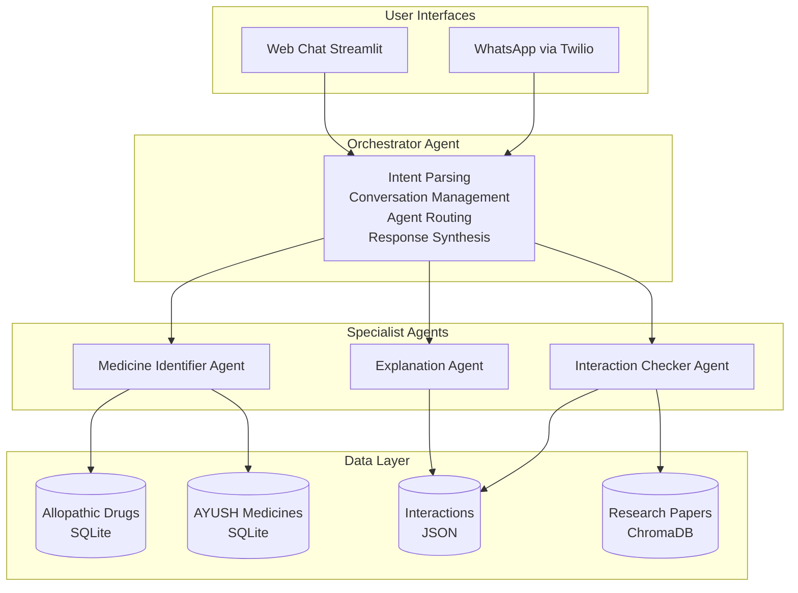
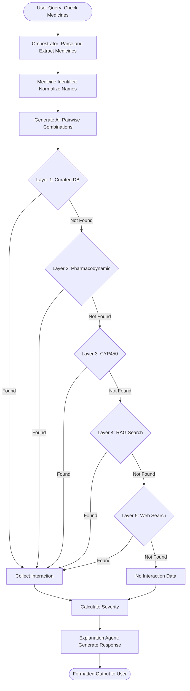
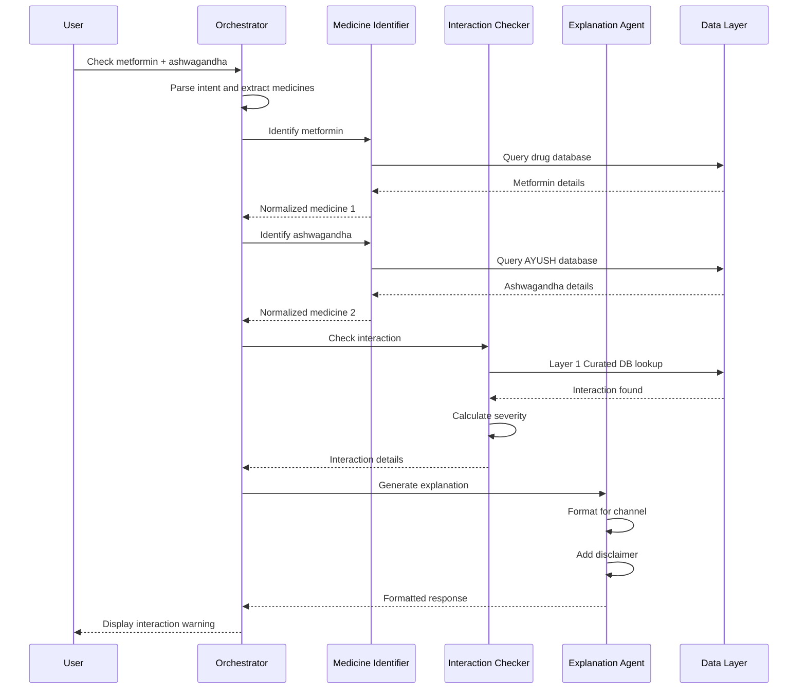
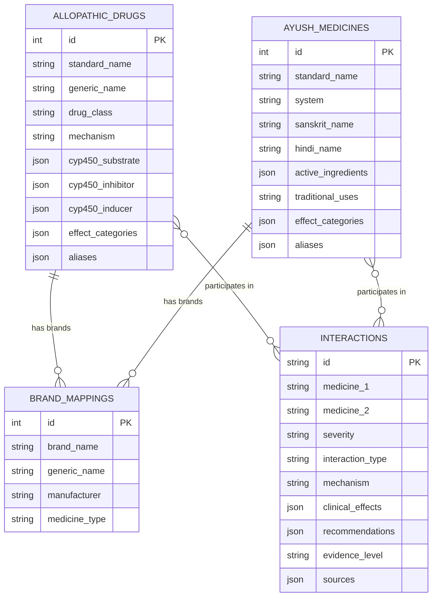
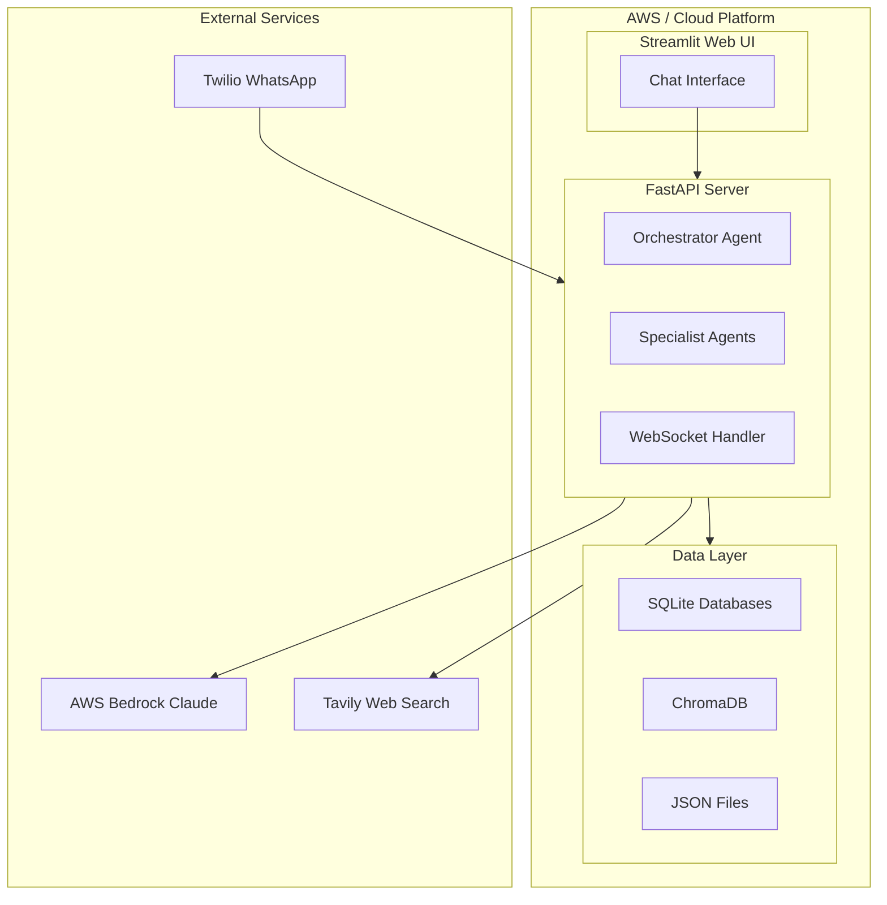

# Design Document

## Overview

AushadhiMitra is a multi-agent AI system that checks for drug interactions between AYUSH (traditional Indian medicine) and allopathic (modern pharmaceutical) medicines. The system provides a conversational interface accessible via WhatsApp and web platforms, employing specialized AI agents to identify medicines, check interactions through multiple data layers, and generate patient-friendly explanations in English and Hindi.

The architecture follows a hub-and-spoke pattern with an Orchestrator Agent coordinating three specialist agents: Medicine Identifier Agent, Interaction Checker Agent, and Explanation Agent. Each agent has specific tools and responsibilities, ensuring separation of concerns and maintainability. The system uses a five-layer interaction checking approach: curated database lookup, pharmacodynamic effect matching, CYP450 pathway inference, research literature search (RAG), and web search fallback.

**Key Design Principles:**
- Multi-agent architecture for separation of concerns
- Layered interaction checking from high-confidence to inferred
- Patient-first explanations with appropriate medical disclaimers
- Bilingual support (English and Hindi)
- Evidence-based recommendations with source citations
- Graceful degradation when data is incomplete

## Architecture

### System Architecture

The system consists of four main layers:

1. **Interface Layer**: WhatsApp (via Twilio) and Web Chat (Streamlit) interfaces
2. **Orchestration Layer**: Orchestrator Agent managing conversation flow and agent routing
3. **Agent Layer**: Three specialist agents (Medicine Identifier, Interaction Checker, Explanation)
4. **Data Layer**: SQLite databases, JSON files, and ChromaDB vector store




### Technology Stack

**Core Technologies:**
- **Language**: Python 3.10+
- **Agent Framework**: CrewAI for multi-agent orchestration
- **LLM**: Amazon Bedrock API (Claude) for reasoning and generation
- **Backend**: FastAPI with WebSocket support
- **Frontend**: Streamlit for web interface
- **WhatsApp**: Twilio API for messaging

**Data Storage:**
- **Structured Data**: SQLite for medicine databases
- **Interactions**: JSON files for curated interactions
- **Vector Store**: ChromaDB for research paper embeddings
- **Caching**: In-memory caching for frequently accessed data

**Key Libraries:**
- `crewai` - Multi-agent orchestration
- `fastapi` - API server and WebSocket
- `streamlit` - Web UI
- `twilio` - WhatsApp integration
- `boto3` - AWS Bedrock access
- `chromadb` - Vector database for RAG
- `pydantic` - Data validation
- `langchain` - LLM utilities

### Interaction Checking Flow



### Agent Communication Pattern



## Components and Interfaces

### 1. Orchestrator Agent

**Purpose**: Central coordinator that manages conversation flow, parses user intent, routes requests to specialist agents, and synthesizes final responses.

**Responsibilities:**
- Parse user messages to extract medicine names and understand intent
- Maintain conversation state and context across multiple turns
- Route requests to appropriate specialist agents based on intent
- Synthesize responses from multiple agents into coherent output
- Handle error cases and provide fallback responses
- Send progress indicators for complex multi-medicine checks

**Key Methods:**
```python
def parse_user_intent(message: str, context: ConversationContext) -> Intent
def route_to_agent(intent: Intent, context: ConversationContext) -> AgentResponse
def synthesize_response(agent_responses: List[AgentResponse]) -> str
def maintain_context(session_id: str, message: str, response: str) -> None
def send_progress_update(session_id: str, message: str) -> None
```

**Input**: User message (text), session ID, conversation history
**Output**: Formatted response to user, updated conversation state

**Validates Requirements**: 1.1, 1.5, 8.1, 8.2, 8.3, 8.4, 8.5, 9.1, 9.2, 10.1, 10.3, 13.4

### 2. Medicine Identifier Agent

**Purpose**: Normalize medicine names, identify medicine types (AYUSH vs Allopathic), and extract relevant metadata.

**Responsibilities:**
- Normalize medicine names handling misspellings and variations
- Identify medicine type (AYUSH or Allopathic)
- Map brand names to generic names
- Extract ingredients from AYUSH formulations
- Disambiguate when multiple matches exist
- Recognize Hindi medicine names

**Key Methods:**
```python
def normalize_medicine_name(name: str) -> NormalizedMedicine
def identify_medicine_type(name: str) -> MedicineType
def map_brand_to_generic(brand: str) -> str
def extract_ingredients(formulation: str) -> List[str]
def fuzzy_match_medicine(name: str, threshold: float) -> List[Match]
def recognize_hindi_name(hindi_name: str) -> str
```

**Data Structures:**
```python
class NormalizedMedicine:
    standard_name: str
    medicine_type: str  # "AYUSH" or "Allopathic"
    system: Optional[str]  # For AYUSH: "Ayurveda", "Siddha", "Unani", "Homeopathy"
    drug_class: Optional[str]  # For Allopathic
    aliases: List[str]
    active_ingredients: List[str]
    effect_categories: List[str]
    cyp450_interactions: Dict[str, str]
    hindi_name: Optional[str]
```

**Input**: Raw medicine name from user, language context
**Output**: Normalized medicine object with metadata, confidence score, alternative matches if ambiguous

**Validates Requirements**: 1.2, 1.3, 1.4, 2.1, 2.2, 2.3, 2.4, 2.5, 6.4, 9.3, 10.5


### 3. Interaction Checker Agent

**Purpose**: Evaluate potential interactions between medicines using a five-layer checking approach.

**Responsibilities:**
- Check curated interaction database (Layer 1)
- Evaluate pharmacodynamic effect overlaps (Layer 2)
- Infer CYP450 pathway interactions (Layer 3)
- Search research literature via RAG (Layer 4)
- Perform web search as fallback (Layer 5)
- Calculate interaction severity
- Generate all pairwise combinations for multiple medicines

**Five-Layer Checking Approach:**

1. **Layer 1 - Curated Database**: Direct lookup of known, documented interactions
2. **Layer 2 - Pharmacodynamic Effects**: Check if medicines share effect categories (additive) or have opposing effects (antagonistic)
3. **Layer 3 - CYP450 Pathways**: Evaluate metabolic pathway interactions (inhibitors, inducers, substrates)
4. **Layer 4 - RAG Search**: Search research paper embeddings for documented cases
5. **Layer 5 - Web Search**: Tavily API search as final fallback

**Key Methods:**
```python
def check_all_pairs(medicines: List[NormalizedMedicine]) -> List[Interaction]
def check_curated_database(med1: str, med2: str) -> Optional[Interaction]
def check_pharmacodynamic_overlap(med1: NormalizedMedicine, med2: NormalizedMedicine) -> Optional[Interaction]
def check_cyp450_interaction(med1: NormalizedMedicine, med2: NormalizedMedicine) -> Optional[Interaction]
def search_research_literature(med1: str, med2: str) -> List[ResearchEvidence]
def web_search_fallback(med1: str, med2: str) -> List[WebSearchResult]
def calculate_severity(interaction: Interaction) -> SeverityLevel
```

**Data Structures:**
```python
class Interaction:
    medicine_1: str
    medicine_2: str
    severity: str  # "Safe", "Caution", "Warning", "Danger"
    interaction_type: str  # "Pharmacodynamic", "Pharmacokinetic", "Both"
    mechanism: str
    clinical_effects: List[str]
    recommendations: List[str]
    evidence_level: str  # "High", "Medium", "Low"
    evidence_sources: List[str]
    effect_type: Optional[str]  # "Additive", "Antagonistic", "Synergistic"
```

**Severity Calculation Logic:**
```python
def calculate_severity(interaction: Interaction) -> str:
    if "life-threatening" in interaction.clinical_effects:
        return "Danger"
    
    if interaction.evidence_level == "High":
        if interaction.interaction_type in ["Pharmacodynamic", "Pharmacokinetic"]:
            if interaction.effect_type == "Additive":
                return "Warning"
    
    if "inferred" in interaction.evidence_sources:
        return "Caution"
    
    return "Safe"
```

**Input**: List of normalized medicines
**Output**: List of interactions with severity levels and evidence sources

**Validates Requirements**: 3.1, 3.2, 3.3, 3.4, 3.5, 4.1, 4.2, 4.3, 7.1, 9.4, 10.2, 11.1, 11.3, 11.4, 11.5, 12.2, 12.3, 15.1, 15.2, 15.3, 15.4, 15.5


### 4. Explanation Agent

**Purpose**: Generate patient-friendly explanations, translate to Hindi, and format responses for different channels.

**Responsibilities:**
- Generate plain-language explanations of interaction mechanisms
- Describe observable symptoms and effects
- Provide actionable recommendations
- Translate content to Hindi when requested
- Format responses for WhatsApp (with emojis) or web
- Add appropriate medical disclaimers
- Generate shareable reports

**Key Methods:**
```python
def generate_explanation(interaction: Interaction, language: str) -> str
def translate_to_hindi(text: str) -> str
def format_for_channel(response: str, channel: str) -> str
def add_disclaimer(severity: str) -> str
def generate_report(interactions: List[Interaction], medicines: List[str]) -> str
def format_severity_indicator(severity: str, channel: str) -> str
```

**Input**: Interaction details, language preference, output channel
**Output**: Formatted, user-friendly explanation with disclaimers

**Validates Requirements**: 4.5, 5.1, 5.2, 5.3, 5.4, 5.5, 6.1, 6.2, 6.3, 6.5, 9.5, 13.1, 13.2, 13.3, 14.2, 14.3, 16.1, 16.2, 16.3, 16.4, 16.5

### 5. Interface Layer

**WhatsApp Interface:**
```python
class WhatsAppInterface:
    def receive_message(self, from_number: str, message: str) -> None:
        session_id = self.get_or_create_session(from_number)
        response = orchestrator.process_message(message, session_id, channel="whatsapp")
        self.send_message(from_number, response)
    
    def send_message(self, to_number: str, message: str) -> None:
        # Format with emoji indicators
        # Handle WhatsApp message length limits
        self.twilio_client.messages.create(...)
```

**Web Interface:**
```python
class WebInterface:
    def render_chat(self):
        # Display conversation history
        # Input box for user message
        # Send button
        # Display formatted responses with severity colors
```

**Validates Requirements**: 14.1, 14.4, 14.5


## Data Models

### Database Schema Overview



### Database Schema

**Allopathic Drugs Table:**
```sql
CREATE TABLE allopathic_drugs (
    id INTEGER PRIMARY KEY,
    standard_name TEXT NOT NULL,
    generic_name TEXT,
    drug_class TEXT,
    mechanism TEXT,
    common_uses TEXT,
    cyp450_substrate TEXT,  -- JSON array
    cyp450_inhibitor TEXT,  -- JSON array
    cyp450_inducer TEXT,    -- JSON array
    effect_categories TEXT, -- JSON array
    aliases TEXT            -- JSON array
);
```

**AYUSH Medicines Table:**
```sql
CREATE TABLE ayush_medicines (
    id INTEGER PRIMARY KEY,
    standard_name TEXT NOT NULL,
    system TEXT,  -- Ayurveda, Siddha, Unani, Homeopathy
    sanskrit_name TEXT,
    hindi_name TEXT,
    active_ingredients TEXT,  -- JSON array
    traditional_uses TEXT,
    pharmacodynamics TEXT,
    effect_categories TEXT,   -- JSON array
    aliases TEXT              -- JSON array
);
```

**Brand Name Mapping Table:**
```sql
CREATE TABLE brand_mappings (
    id INTEGER PRIMARY KEY,
    brand_name TEXT NOT NULL,
    generic_name TEXT NOT NULL,
    manufacturer TEXT,
    medicine_type TEXT  -- "AYUSH" or "Allopathic"
);
```

### Curated Interactions (JSON)

```json
{
  "interactions": [
    {
      "id": "INT001",
      "medicine_1": {
        "name": "Ashwagandha",
        "type": "AYUSH",
        "system": "Ayurveda"
      },
      "medicine_2": {
        "name": "Metformin",
        "type": "Allopathic",
        "class": "Biguanide"
      },
      "interaction": {
        "severity": "Warning",
        "type": "Pharmacodynamic",
        "mechanism": "Additive hypoglycemic effect",
        "clinical_effects": ["Hypoglycemia", "Shakiness", "Sweating"],
        "recommendations": [
          "Monitor blood glucose closely",
          "Keep glucose source available"
        ],
        "evidence_level": "Medium",
        "sources": ["Drugs.com", "PMID:12345678"]
      }
    }
  ]
}
```

### Effect Categories (JSON)

```json
{
  "effect_categories": {
    "blood_sugar_lowering": {
      "description": "Medicines that reduce blood glucose levels",
      "allopathic": ["Metformin", "Glipizide", "Insulin"],
      "ayush": ["Ashwagandha", "Gymnema", "Bitter Melon"],
      "opposes": "blood_sugar_raising"
    },
    "blood_thinning": {
      "description": "Medicines with anticoagulant or antiplatelet effects",
      "allopathic": ["Warfarin", "Aspirin", "Clopidogrel"],
      "ayush": ["Turmeric", "Garlic", "Ginger"],
      "opposes": null
    },
    "sedation_cns_depression": {
      "description": "Medicines that cause drowsiness or CNS depression",
      "allopathic": ["Alprazolam", "Zolpidem", "Codeine"],
      "ayush": ["Valerian", "Brahmi", "Jatamansi"],
      "opposes": "cns_stimulation"
    }
  }
}
```

### CYP450 Rules (JSON)

```json
{
  "cyp450_pathways": {
    "CYP3A4": {
      "substrates": ["Simvastatin", "Amlodipine", "Alprazolam"],
      "inhibitors": ["Grapefruit", "Ketoconazole"],
      "inducers": ["Rifampin", "St. John's Wort"],
      "interaction_rule": "Inhibitor + Substrate = Increased substrate levels (Warning)"
    }
  }
}
```


## Correctness Properties

*A property is a characteristic or behavior that should hold true across all valid executions of a system—essentially, a formal statement about what the system should do. Properties serve as the bridge between human-readable specifications and machine-verifiable correctness guarantees.*

### Property 1: Medicine name normalization consistency
*For any* medicine name and its known aliases, normalizing any alias should produce the same standard name
**Validates: Requirements 1.2, 2.5**

### Property 2: Medicine type classification completeness
*For any* medicine in the database, it should be classified as exactly one type (AYUSH or Allopathic)
**Validates: Requirements 2.1**

### Property 3: AYUSH system classification
*For any* AYUSH medicine, it should have exactly one system classification (Ayurveda, Siddha, Unani, or Homeopathy)
**Validates: Requirements 2.2**

### Property 4: Pairwise interaction checking completeness
*For any* list of N medicines where N ≥ 2, the system should check exactly N*(N-1)/2 unique pairs for interactions
**Validates: Requirements 3.1, 7.1**

### Property 5: Interaction checking layer cascade
*For any* medicine pair, if Layer 1 (curated database) returns no result, then Layer 2 (pharmacodynamic) should be invoked; if Layer 2 returns no result, then Layer 3 (CYP450) should be invoked; if Layer 3 returns no result, then Layer 4 (RAG) should be invoked
**Validates: Requirements 3.2, 3.3, 3.4, 3.5**

### Property 6: Interaction severity ordering
*For any* list of interactions, when presented to the user, they should be ordered by severity: Danger > Warning > Caution > Safe
**Validates: Requirements 4.4**

### Property 7: Interaction schema completeness
*For any* interaction found, it should contain all required fields: medicine_1, medicine_2, severity (one of: Safe/Caution/Warning/Danger), mechanism, clinical_effects, recommendations, evidence_level (High/Medium/Low), and evidence_sources
**Validates: Requirements 4.1, 11.1, 11.5**

### Property 8: High-severity disclaimer presence
*For any* interaction with severity Warning or Danger, the explanation should include both urgent action recommendations and explicit advice to consult a healthcare provider
**Validates: Requirements 4.5, 13.2**

### Property 9: Explanation completeness
*For any* interaction, the generated explanation should contain: mechanism description, observable symptoms/effects, and actionable recommendations
**Validates: Requirements 5.1, 5.2, 5.3**

### Property 10: Evidence citation completeness
*For any* interaction with evidence from research papers, the citation should include either a PubMed ID or DOI
**Validates: Requirements 5.4, 11.2**

### Property 11: Hindi translation completeness
*For any* interaction explanation requested in Hindi, the output should contain Hindi characters and include both Hindi medicine names (when available) and standard medical names
**Validates: Requirements 6.1, 6.3**

### Property 12: Hindi severity translation
*For any* severity level displayed in Hindi, it should map to the correct Hindi equivalent: Safe→सुरक्षित, Caution→सावधानी, Warning→चेतावनी, Danger→खतरा
**Validates: Requirements 6.5**

### Property 13: Hindi input recognition
*For any* medicine with a Hindi name in the database, providing the Hindi name as input should resolve to the same standard medicine as providing the English name
**Validates: Requirements 6.4**

### Property 14: Multiple interaction summary completeness
*For any* set of interactions found, the summary should include all interactions grouped by severity level
**Validates: Requirements 7.2, 7.3**

### Property 15: Conversation context persistence
*For any* conversation session, information from previous turns should be accessible in subsequent turns within the same session
**Validates: Requirements 8.1, 8.3**

### Property 16: Clarification request on ambiguity
*For any* medicine identification with confidence below threshold (e.g., 0.7), the system should request clarification and present multiple options
**Validates: Requirements 1.5, 10.5**

### Property 17: Agent routing exclusivity
*For any* single request from the Orchestrator, exactly one specialist agent should be invoked at a time
**Validates: Requirements 9.1**

### Property 18: Agent response structure
*For any* specialist agent response, it should conform to a structured schema with defined fields (not free-form text)
**Validates: Requirements 9.2**

### Property 19: Agent responsibility separation
*For any* agent execution, the Medicine Identifier should not check interactions, the Interaction Checker should not generate user-facing text, and the Explanation Agent should not identify medicines or check interactions
**Validates: Requirements 9.3, 9.4, 9.5**

### Property 20: Error message user-friendliness
*For any* system error, the message presented to the user should not contain stack traces or technical error codes
**Validates: Requirements 10.3**

### Property 21: Graceful degradation with cached data
*For any* external data source failure, the system should continue operating using cached data and inform the user of reduced functionality
**Validates: Requirements 10.4**

### Property 22: Inferred interaction labeling
*For any* interaction identified through pharmacodynamic effect matching or CYP450 inference (not curated database), it should be clearly labeled as "inferred" in the evidence sources
**Validates: Requirements 11.3, 15.5**

### Property 23: CYP450 pathway specification
*For any* interaction identified through CYP450 pathways, the interaction details should specify which enzyme pathway is involved (e.g., CYP3A4, CYP2D6)
**Validates: Requirements 11.4**

### Property 24: Curated database query performance
*For any* medicine pair query to the curated database, the response time should be under 100 milliseconds
**Validates: Requirements 12.2**

### Property 25: Curated database prioritization
*For any* medicine pair that exists in the curated database, the curated data should be used as the primary source, and other checking layers should not override it
**Validates: Requirements 12.3**

### Property 26: Hot-reload capability
*For any* update to the curated interaction database file, the system should reload the data within 5 seconds without requiring a restart
**Validates: Requirements 12.4**

### Property 27: Universal disclaimer presence
*For any* interaction result displayed, it should include a disclaimer stating the information is for informational purposes only and does not replace professional medical advice
**Validates: Requirements 13.1**

### Property 28: Prohibited recommendation content
*For any* recommendation generated, it should not contain phrases advising to stop medication or change dosage without consulting a healthcare provider
**Validates: Requirements 13.3**

### Property 29: Out-of-scope redirection
*For any* user question about medical advice beyond interaction checking (e.g., diagnosis, treatment), the system should redirect to consult a healthcare professional
**Validates: Requirements 13.4**

### Property 30: WhatsApp emoji severity indicators
*For any* interaction result sent via WhatsApp, the severity should be indicated with the correct emoji: 🟢 for Safe, 🟡 for Caution, 🟠 for Warning, 🔴 for Danger
**Validates: Requirements 14.3**

### Property 31: WhatsApp message routing
*For any* message received via WhatsApp, it should be processed through the Orchestrator Agent using the same logic as web interface messages
**Validates: Requirements 14.1**

### Property 32: Session timeout duration
*For any* conversation session, context should be maintained for at least 30 minutes of inactivity before expiring
**Validates: Requirements 14.4**

### Property 33: Interface feature parity
*For any* core functionality (medicine identification, interaction checking, explanation generation), both WhatsApp and web interfaces should support it
**Validates: Requirements 14.5**

### Property 34: Effect category assignment
*For any* medicine in the database, it should be assigned to at least one effect category from the defined set
**Validates: Requirements 15.1**

### Property 35: Additive interaction detection
*For any* two medicines that share at least one effect category, the Interaction Checker should flag a potential additive interaction
**Validates: Requirements 15.2**

### Property 36: Antagonistic interaction detection
*For any* two medicines that have opposing effect categories, the Interaction Checker should flag a potential antagonistic interaction
**Validates: Requirements 15.3**

### Property 37: AYUSH effect category inference
*For any* AYUSH medicine without a pre-assigned effect category, the system should attempt to infer the effect category from its traditional uses and known active compounds before reporting "unknown"
**Validates: Requirements 15.4**

### Property 38: Progress indicator for complex checks
*For any* interaction check involving 4 or more medicines, the Orchestrator should send at least one progress update to the user before the final response
**Validates: Requirements 7.5**

### Property 39: Report generation completeness
*For any* report generated, it should include: all medicine names checked, all interactions found, severity levels, evidence sources, timestamp, and healthcare provider consultation recommendation
**Validates: Requirements 16.1, 16.2, 16.4, 16.5**

### Property 40: Report shareability format
*For any* report generated, it should be formatted as plain text or markdown suitable for copying, forwarding, or printing
**Validates: Requirements 16.3**


## Error Handling

### Error Categories and Responses

**1. Medicine Not Found**
- **Trigger**: Medicine name not in any database and fuzzy matching fails
- **Response**: "I couldn't find [medicine name] in my database. Could you check the spelling or try a different name? I can also search the web for information."
- **Fallback**: Offer Tavily web search
- **Validates**: Requirement 10.1

**2. Low Confidence Identification**
- **Trigger**: Multiple medicines match with similar confidence scores
- **Response**: "I found multiple medicines matching '[input]'. Did you mean: 1) [Option A], 2) [Option B], 3) [Option C]?"
- **Action**: Wait for user selection
- **Validates**: Requirements 1.5, 10.5

**3. Insufficient Evidence**
- **Trigger**: All checking layers return no interaction data
- **Response**: "I don't have enough information about interactions between [Med A] and [Med B]. This doesn't mean they're safe together—please consult your pharmacist or doctor."
- **Severity**: Caution (not Safe)
- **Validates**: Requirements 10.2, 13.5

**4. External Service Failure**
- **Trigger**: RAG search, Tavily API, or LLM API fails
- **Response**: "I'm having trouble accessing some data sources. I can still check against my core database. Results may be incomplete."
- **Action**: Continue with cached/local data only
- **Validates**: Requirement 10.4

**5. Invalid Input**
- **Trigger**: User sends non-medicine-related query
- **Response**: "I specialize in checking medicine interactions. Could you tell me which medicines you'd like me to check?"
- **Action**: Prompt for medicine names
- **Validates**: Requirement 13.4

**6. Session Timeout**
- **Trigger**: User inactive for >30 minutes
- **Response**: "Your session has expired. Please start a new interaction check."
- **Action**: Clear context, start fresh
- **Validates**: Requirement 14.4

**7. Rate Limiting**
- **Trigger**: Too many requests from same user
- **Response**: "You've made many requests recently. Please wait a moment before checking again."
- **Action**: Implement exponential backoff

### Error Handling Principles

1. **Never claim safety by default**: Absence of evidence ≠ evidence of absence
2. **Always provide actionable next steps**: Don't just say "error occurred"
3. **Maintain user trust**: Be transparent about limitations
4. **Graceful degradation**: Partial functionality > complete failure
5. **Log for improvement**: Track errors to improve database coverage


## Testing Strategy

### Unit Testing

Unit tests will verify specific examples and integration points between components. Key areas:

**Medicine Identifier Agent:**
- Test normalization of known brand names (e.g., "Glycomet" → "Metformin")
- Test spell correction for common misspellings (e.g., "metformine" → "Metformin")
- Test Hindi name recognition (e.g., "हल्दी" → "Turmeric")
- Test ingredient extraction from formulations

**Interaction Checker Agent:**
- Test curated database lookups for known pairs
- Test pharmacodynamic effect matching logic
- Test CYP450 inference rules
- Test severity calculation for different scenarios

**Explanation Agent:**
- Test disclaimer inclusion in all outputs
- Test emoji formatting for WhatsApp
- Test Hindi translation for key phrases
- Test report generation format

**Orchestrator Agent:**
- Test intent parsing for different query types
- Test agent routing logic
- Test context persistence across turns
- Test error handling and fallbacks

### Property-Based Testing

Property-based tests will verify universal properties across all inputs using **Hypothesis** (Python PBT library). Each test will run a minimum of 100 iterations with randomly generated inputs.

**Configuration:**
```python
from hypothesis import given, settings, strategies as st

@settings(max_examples=100)
```

**Test Generators:**
```python
# Medicine name generator
medicine_names = st.sampled_from([
    "Metformin", "Ashwagandha", "Turmeric", "Warfarin", ...
])

# Severity level generator
severity_levels = st.sampled_from(["Safe", "Caution", "Warning", "Danger"])

# Interaction generator
@st.composite
def interaction_strategy(draw):
    return Interaction(
        medicine_1=draw(medicine_names),
        medicine_2=draw(medicine_names),
        severity=draw(severity_levels),
        ...
    )
```

**Property Test Tagging:**
Each property-based test must include a comment explicitly referencing the design document property:

```python
@given(medicine_names, medicine_names)
@settings(max_examples=100)
def test_pairwise_checking_completeness(med1, med2):
    """
    Feature: ayush-allopathy-checker, Property 4: Pairwise interaction checking completeness
    
    For any list of N medicines where N ≥ 2, the system should check 
    exactly N*(N-1)/2 unique pairs for interactions.
    """
    # Test implementation
```

**Key Property Tests:**

1. **Property 1 Test**: Generate medicine aliases, verify all normalize to same standard name
2. **Property 4 Test**: Generate lists of N medicines, verify N*(N-1)/2 pairs checked
3. **Property 5 Test**: Generate medicine pairs not in curated DB, verify layer cascade
4. **Property 6 Test**: Generate interaction lists, verify severity ordering
5. **Property 7 Test**: Generate interactions, verify schema completeness
6. **Property 11 Test**: Generate interactions, request Hindi, verify Hindi characters present
7. **Property 13 Test**: Generate Hindi medicine names, verify resolution to standard names
8. **Property 19 Test**: Monitor agent calls, verify no agent performs another's responsibilities
9. **Property 24 Test**: Generate medicine pairs, measure query time < 100ms
10. **Property 27 Test**: Generate any interaction result, verify disclaimer present
11. **Property 30 Test**: Generate interactions for WhatsApp, verify correct emoji
12. **Property 35 Test**: Generate medicine pairs with shared effect categories, verify additive flag
13. **Property 39 Test**: Generate reports, verify all required fields present

### Integration Testing

Integration tests will verify end-to-end flows:

1. **WhatsApp to Response Flow**: Send message via Twilio → verify formatted response
2. **Multi-turn Conversation**: Send sequence of messages → verify context maintained
3. **Database Hot-reload**: Update interaction JSON → verify new data used within 5s
4. **Fallback Cascade**: Query unknown pair → verify all 5 layers attempted
5. **Report Generation**: Request report → verify shareable format produced

### Test Data Requirements

**Minimum for Hackathon:**
- 100 curated interactions in JSON
- 50 AYUSH medicines in SQLite
- 100 allopathic drugs in SQLite
- 50 brand name mappings
- 20 Hindi medicine name mappings
- 10 effect category definitions
- 20 CYP450 rules
- 200 research paper abstracts for RAG


## Performance Considerations

### Response Time Targets

- **Medicine identification**: < 200ms
- **Curated database lookup**: < 100ms
- **Pharmacodynamic checking**: < 300ms
- **CYP450 inference**: < 200ms
- **RAG search**: < 2s
- **Explanation generation**: < 1s
- **Total end-to-end**: < 5s for simple queries, < 10s for complex multi-medicine checks

### Scalability Considerations

**Hackathon Scope:**
- Support 10-50 concurrent users
- Handle 1000 queries per day
- SQLite sufficient for data storage
- In-memory caching for curated interactions

**Production Considerations (Future):**
- Migrate to PostgreSQL with connection pooling
- Implement Redis for session management
- Use CDN for static assets
- Horizontal scaling with Kubernetes
- Rate limiting per user (10 requests/minute)

### Caching Strategy

1. **Curated Interactions**: Load into memory at startup, refresh every 5 minutes
2. **Medicine Metadata**: Cache in Redis with 1-hour TTL
3. **RAG Embeddings**: Pre-compute and store in ChromaDB
4. **LLM Responses**: Cache common explanations for 24 hours
5. **Session Context**: Store in Redis with 30-minute TTL

## Security and Privacy

### Data Privacy

1. **No PII Storage**: Don't store user phone numbers or personal health information
2. **Session Anonymization**: Use random session IDs, not phone numbers
3. **Conversation Logging**: Log only for debugging, auto-delete after 7 days
4. **HIPAA Considerations**: Add disclaimer that system is not HIPAA-compliant

### API Security

1. **Twilio Webhook Validation**: Verify requests are from Twilio
2. **Rate Limiting**: Prevent abuse with per-user limits
3. **Input Sanitization**: Prevent injection attacks
4. **API Key Management**: Use environment variables, never commit keys

### Disclaimer and Liability

Every response must include:
> ⚠️ **Disclaimer**: This information is for educational purposes only and does not constitute medical advice. Always consult your doctor or pharmacist before starting, stopping, or changing any medication.


## Deployment Architecture



**Deployment Components:**

1. **FastAPI Server**: Hosts Orchestrator and specialist agents, handles WebSocket connections
2. **Streamlit Web UI**: Separate container for web chat interface
3. **Data Layer**: SQLite files, ChromaDB, and JSON files on persistent volumes
4. **External Services**: Twilio for WhatsApp, AWS Bedrock for LLM, Tavily for web search

## Future Enhancements

### Phase 1 (Post-Hackathon)
- Prescription OCR for medicine extraction from photos
- Voice input support for accessibility
- Expanded interaction database (1000+ pairs)
- Real-time PubMed integration for latest research

### Phase 2 (Month 3-6)
- Personalized risk assessment based on age and conditions
- Doctor dashboard for patient medication review
- Integration with Indian pharmacy APIs (1mg, PharmEasy)
- PDF report generation with branding

### Phase 3 (Month 6-12)
- 10 regional languages (Tamil, Telugu, Bengali, Marathi, Gujarati, etc.)
- ABDM/Health Stack integration for EHR access
- Pharmacovigilance reporting to AYUSH Suraksha
- Offline mode for low-connectivity areas
- Community contribution platform for verified practitioners


## Appendix: Sample Conversation Flows

### Example 1: Simple Two-Medicine Check

```
USER: I take metformin for diabetes and ashwagandha for stress. Is this safe?

SYSTEM:
━━━━━━━━━━━━━━━━━━━━━━━━━━━━━━━━━
🟠 WARNING: Interaction Found
━━━━━━━━━━━━━━━━━━━━━━━━━━━━━━━━━

Metformin + Ashwagandha

Both medicines can lower blood sugar. When taken 
together, your sugar levels might drop more than 
expected.

🔍 What to watch for:
• Shakiness or trembling
• Excessive sweating
• Sudden hunger
• Dizziness or confusion

✅ Recommendations:
• Monitor your blood sugar more frequently
• Keep glucose tablets or sugar handy
• Inform your doctor about the Ashwagandha
• Don't stop either medicine without consulting

📚 Evidence: Clinical studies (Medium confidence)

⚠️ Disclaimer: This information is for educational 
purposes only. Always consult your doctor or 
pharmacist before making medication changes.

Would you like me to check any other medicines?
━━━━━━━━━━━━━━━━━━━━━━━━━━━━━━━━━
```

### Example 2: Multi-Medicine Check with Progress Indicators

```
USER: I take metformin, amlodipine, ashwagandha, triphala, and ecosprin daily. Check all interactions.

SYSTEM: 🔄 Checking interactions for 5 medicines (10 combinations)...

SYSTEM: ✅ Identified all 5 medicines. Checking interactions...

SYSTEM:
━━━━━━━━━━━━━━━━━━━━━━━━━━━━━━━━━
📊 Interaction Check Complete
━━━━━━━━━━━━━━━━━━━━━━━━━━━━━━━━━

Checked 5 medicines (10 combinations)
Found 2 interactions

🟠 WARNING LEVEL (1)
━━━━━━━━━━━━━━━━━━━━━━━━━━━━━━━━━

Metformin + Ashwagandha
Both lower blood sugar - risk of hypoglycemia
→ Monitor glucose closely, keep sugar handy

🟡 CAUTION LEVEL (1)
━━━━━━━━━━━━━━━━━━━━━━━━━━━━━━━━━

Ecosprin + Ashwagandha
Both have blood-thinning effects
→ Watch for unusual bruising or bleeding

🟢 SAFE COMBINATIONS (8)
━━━━━━━━━━━━━━━━━━━━━━━━━━━━━━━━━

• Metformin + Amlodipine ✓
• Metformin + Triphala ✓
• Metformin + Ecosprin ✓
• Amlodipine + Ashwagandha ✓
• Amlodipine + Triphala ✓
• Amlodipine + Ecosprin ✓
• Ashwagandha + Triphala ✓
• Triphala + Ecosprin ✓

⚠️ Disclaimer: This information is for educational 
purposes only. Always consult your doctor or 
pharmacist before making medication changes.

Would you like a detailed report to share with 
your doctor?
━━━━━━━━━━━━━━━━━━━━━━━━━━━━━━━━━
```

### Example 3: Hindi Language Request

```
USER: मुझे मेटफॉर्मिन और अश्वगंधा के बारे में हिंदी में बताएं

SYSTEM:
━━━━━━━━━━━━━━━━━━━━━━━━━━━━━━━━━
🟠 चेतावनी: इंटरैक्शन मिला
━━━━━━━━━━━━━━━━━━━━━━━━━━━━━━━━━

मेटफॉर्मिन (Metformin) + अश्वगंधा (Ashwagandha)

दोनों दवाएं ब्लड शुगर कम कर सकती हैं। साथ में लेने 
पर आपका शुगर लेवल उम्मीद से ज्यादा गिर सकता है।

🔍 इन लक्षणों पर ध्यान दें:
• कंपकंपी या कांपना
• अत्यधिक पसीना आना
• अचानक भूख लगना
• चक्कर आना या भ्रम

✅ सिफारिशें:
• अपने ब्लड शुगर की अधिक बार जांच करें
• ग्लूकोज टैबलेट या चीनी पास रखें
• अपने डॉक्टर को अश्वगंधा के बारे में बताएं

📚 साक्ष्य: क्लिनिकल अध्ययन (मध्यम विश्वसनीयता)

⚠️ अस्वीकरण: यह जानकारी केवल शैक्षिक उद्देश्यों के 
लिए है। दवा में कोई भी बदलाव करने से पहले हमेशा 
अपने डॉक्टर या फार्मासिस्ट से परामर्श करें।
━━━━━━━━━━━━━━━━━━━━━━━━━━━━━━━━━
```

### Example 4: Clarification Request

```
USER: I'm taking metform

SYSTEM: I found multiple medicines matching 'metform'. Did you mean:
1) Metformin (for diabetes)
2) Metformin Extended Release
3) Metformin + Glipizide combination

Please reply with the number or full name.

USER: 1

SYSTEM: Got it! You're taking Metformin. What other medicines would you like me to check it against?
```

### Example 5: No Interaction Found

```
USER: Can I take vitamin D with turmeric?

SYSTEM:
━━━━━━━━━━━━━━━━━━━━━━━━━━━━━━━━━
🟢 No Known Interactions
━━━━━━━━━━━━━━━━━━━━━━━━━━━━━━━━━

Vitamin D + Turmeric (Haldi)

I didn't find any documented interactions between 
these two. However, this doesn't guarantee they're 
completely safe together.

✅ General Recommendations:
• Take as directed by your healthcare provider
• Monitor for any unusual symptoms
• Inform your doctor about all supplements

⚠️ Note: Lack of documented interactions doesn't 
mean interactions are impossible. New research 
emerges regularly.

⚠️ Disclaimer: This information is for educational 
purposes only. Always consult your doctor or 
pharmacist before making medication changes.

Would you like me to check any other medicines?
━━━━━━━━━━━━━━━━━━━━━━━━━━━━━━━━━
```
