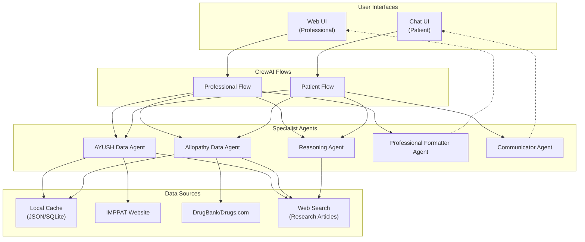
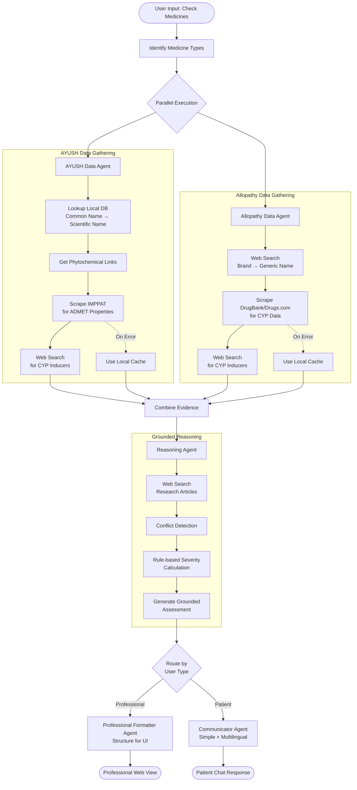
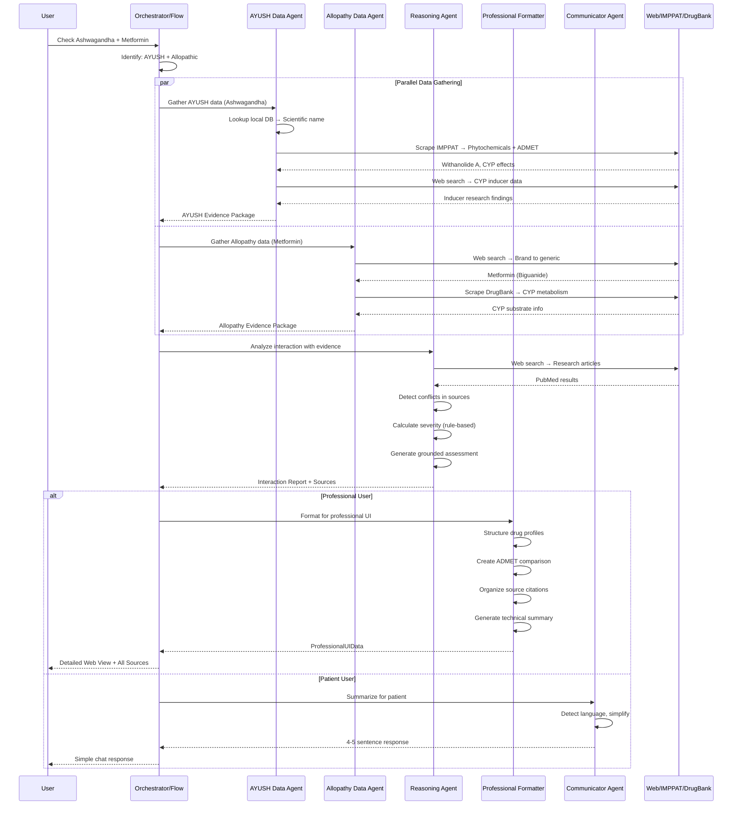
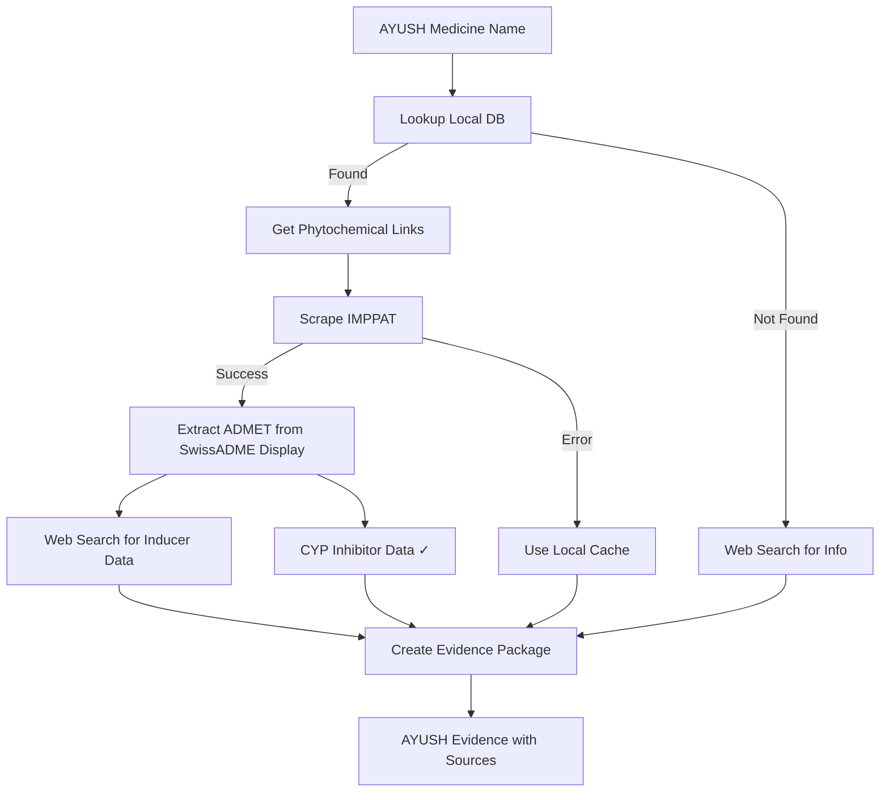
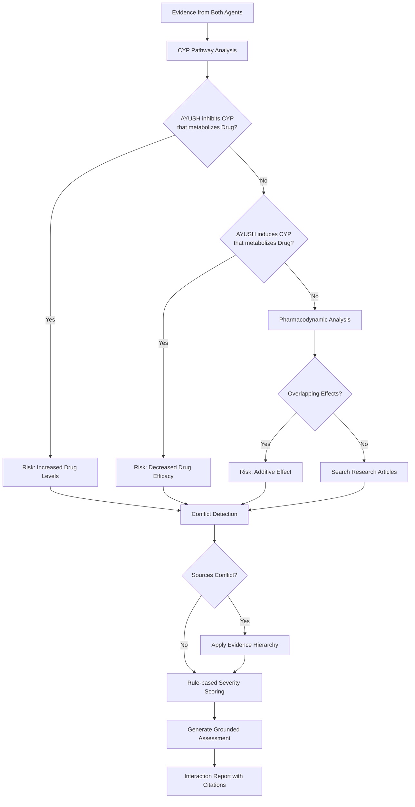
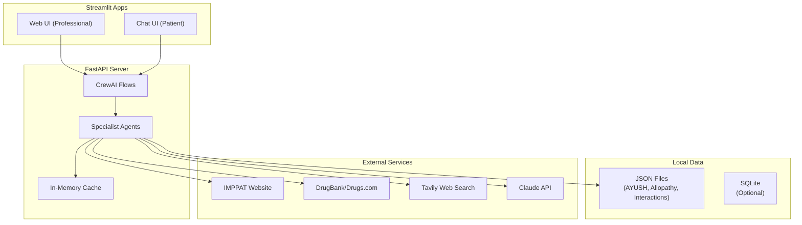

# Design Document

## Overview

AushadhiMitra is a multi-agent AI system that checks for drug interactions between AYUSH (traditional Indian medicine) and allopathic (modern pharmaceutical) medicines. The system uses CrewAI Flows to orchestrate parallel data gathering from multiple sources (IMPPAT for AYUSH phytochemicals, DrugBank/Drugs.com for allopathic drugs, web search for research), performs grounded reasoning with conflict detection, and generates responses tailored to two user personas: AYUSH practitioners (detailed technical view) and patients (simple multilingual chat).

The architecture emphasizes real-time data gathering to ensure accuracy and relevancy, with automatic fallback to local cached data for reliability. All responses are strictly grounded in gathered evidence with full source citation and transparent handling of conflicting information.

**Key Design Principles:**
- Real-time data gathering with local fallback for reliability
- Grounded reasoning - LLM uses ONLY provided evidence, not internal knowledge
- Transparent conflict detection and reporting when sources disagree
- Evidence hierarchy for resolving conflicts (Clinical > In Vivo > In Vitro > Predicted)
- Full source citation with clickable URLs for verification
- Rule-based severity scoring augmented by LLM explanation
- Two user personas with shared data gathering but different output formatting
- Parallel processing for faster response times

**Agent Architecture:**
- **5 Specialist Agents**: AYUSH Data Agent, Allopathy Data Agent, Reasoning Agent, Professional Formatter Agent, Communicator Agent
- **Shared Components**: AYUSH and Allopathy Data Agents used by both Professional and Patient flows
- **Persona-Specific Formatters**: Professional Formatter (structured UI data) and Communicator (multilingual chat)

## Architecture

### System Architecture

The system consists of four main layers:

1. **Interface Layer**: Web UI for professionals, Chat UI (simulating WhatsApp) for patients
2. **Flow Orchestration Layer**: Two CrewAI Flows (Professional and Patient) with shared data agents
3. **Agent Layer**: Five specialist agents (AYUSH Data, Allopathy Data, Reasoning, Professional Formatter, Communicator)
4. **Data Layer**: Local JSON/SQLite for fallback, real-time web scraping for primary data



### Technology Stack

**Core Technologies:**
- **Language**: Python 3.10+
- **Agent Framework**: CrewAI Flows for multi-agent orchestration
- **LLM**: Claude API (via Anthropic or AWS Bedrock) for reasoning and generation
- **Web Scraping**: BeautifulSoup, Requests for IMPPAT/DrugBank scraping
- **Web Search**: Tavily API for research article search
- **Backend**: FastAPI with WebSocket support
- **Frontend**: Streamlit for both Web UI and Chat UI

**Data Storage:**
- **Local Cache**: JSON files for pre-extracted IMPPAT data and curated interactions
- **Medicine Database**: SQLite for AYUSH and allopathic medicine metadata
- **Session State**: In-memory for conversation context

**Key Libraries:**
- `crewai` - Multi-agent orchestration with Flows
- `fastapi` - API server
- `streamlit` - Web and Chat UI
- `beautifulsoup4` - Web scraping
- `requests` - HTTP requests
- `tavily-python` - Web search API
- `anthropic` / `boto3` - LLM access
- `pydantic` - Data validation

### High-Level Data Flow



### Agent Communication Pattern



## Components and Interfaces

### 1. Flow Orchestrator

**Purpose**: Manage the overall workflow using CrewAI Flows, route requests to appropriate flows based on user type, and coordinate parallel agent execution.

**Responsibilities:**
- Determine user type (Professional vs Patient) based on interface
- Initialize and execute the appropriate CrewAI Flow
- Coordinate parallel execution of data gathering agents
- Handle timeouts and partial results
- Maintain conversation context for chat interface

**CrewAI Flow Definition:**
```python
from crewai import Flow, start, listen, router

class AushadhiMitraFlow(Flow):
    
    @start()
    def parse_input(self):
        """Extract medicine names and determine types"""
        # Returns: {ayush_medicines: [], allopathy_medicines: []}
        pass
    
    @listen(parse_input)
    async def gather_data_parallel(self, medicines):
        """Execute data gathering agents in parallel"""
        ayush_task = self.ayush_agent.gather(medicines['ayush_medicines'])
        allo_task = self.allopathy_agent.gather(medicines['allopathy_medicines'])
        
        # Parallel execution
        ayush_data, allo_data = await asyncio.gather(ayush_task, allo_task)
        return {'ayush': ayush_data, 'allo': allo_data}
    
    @listen(gather_data_parallel)
    def analyze_interaction(self, all_data):
        """Reasoning agent analyzes gathered evidence"""
        return self.reasoning_agent.analyze(all_data)
    
    @router(analyze_interaction)
    def route_output(self, analysis):
        """Route to appropriate output formatter"""
        if self.user_type == 'professional':
            return 'format_professional'
        else:
            return 'format_patient'
    
    @listen('format_professional')
    def format_professional(self, analysis):
        """Use Professional Formatter Agent to structure output for web UI"""
        return self.professional_formatter_agent.format(analysis)
    
    @listen('format_patient')
    def format_patient(self, analysis):
        """Use Communicator Agent for patient-friendly response"""
        return self.communicator_agent.summarize(analysis, self.user_language)
```

**Input**: User message, user type (professional/patient), session context
**Output**: Formatted response appropriate for user type

**Validates Requirements**: 4.1, 4.2, 4.3, 4.4, 4.5, 10.1, 10.2, 10.3, 10.4, 10.5

### 2. AYUSH Data Agent

**Purpose**: Gather comprehensive phytochemical and ADMET data for AYUSH medicines through local lookup and web scraping.

**Responsibilities:**
- Lookup local database for common name to scientific name mapping
- Retrieve phytochemical links from pre-extracted IMPPAT data
- Scrape IMPPAT website for ADMET properties (which displays SwissADME data)
- Perform web search for CYP inducer information
- Fallback to local cache on scraping errors

**Data Gathering Flow:**


**Key Methods:**
```python
class AYUSHDataAgent:
    def gather(self, medicine_name: str) -> AYUSHEvidence:
        """Main entry point for AYUSH data gathering"""
        pass
    
    def lookup_local_db(self, common_name: str) -> Optional[AYUSHMedicine]:
        """Lookup common name in local curated database"""
        pass
    
    def get_phytochemical_links(self, scientific_name: str) -> List[str]:
        """Get phytochemical page URLs from pre-extracted IMPPAT data"""
        pass
    
    def scrape_imppat_admet(self, phyto_url: str) -> ADMETProperties:
        """Scrape ADMET properties from IMPPAT (SwissADME display)"""
        pass
    
    def search_cyp_inducers(self, herb_name: str) -> List[CYPInducerInfo]:
        """Web search for CYP inducer research data"""
        pass
    
    def get_fallback_data(self, medicine_name: str) -> Optional[AYUSHEvidence]:
        """Retrieve from local cache when scraping fails"""
        pass
```

**Data Structures:**
```python
@dataclass
class AYUSHEvidence:
    medicine_name: str
    scientific_name: str
    system: str  # Ayurveda, Siddha, Unani, Homeopathy
    phytochemicals: List[Phytochemical]
    sources: List[SourceCitation]
    data_source: str  # "realtime" or "cached"
    
@dataclass
class Phytochemical:
    name: str
    smiles: Optional[str]
    imppat_url: str
    cyp_effects: Dict[str, CYPEffect]  # e.g., {"CYP3A4": CYPEffect(...)}
    
@dataclass
class CYPEffect:
    enzyme: str
    is_inhibitor: bool
    is_inducer: bool
    is_substrate: bool
    strength: str  # "strong", "moderate", "weak", "none"
    evidence_type: str  # "in_vitro", "in_vivo", "predicted"
    source_url: str
```

**Input**: AYUSH medicine name (common or scientific)
**Output**: AYUSHEvidence with phytochemicals, CYP effects, and source URLs

**Validates Requirements**: 2.1, 2.2, 2.3, 2.4, 2.5, 2.6, 11.1, 11.2, 11.5

### 3. Allopathy Data Agent

**Purpose**: Gather comprehensive ADMET and CYP metabolism data for allopathic drugs through web search and scraping.

**Responsibilities:**
- Perform web search to resolve brand names to generic names
- Scrape DrugBank.com or Drugs.com for CYP metabolism data
- Search for additional CYP inducer information
- Fallback to local cache on scraping errors

**Key Methods:**
```python
class AllopathyDataAgent:
    def gather(self, drug_name: str) -> AllopathyEvidence:
        """Main entry point for allopathy data gathering"""
        pass
    
    def search_brand_to_generic(self, brand_name: str) -> DrugIdentity:
        """Web search to find generic name and composition"""
        pass
    
    def scrape_drugbank(self, generic_name: str) -> DrugMetabolism:
        """Scrape DrugBank for CYP substrate/inhibitor/inducer data"""
        pass
    
    def scrape_drugs_com(self, generic_name: str) -> DrugMetabolism:
        """Alternative: scrape Drugs.com for metabolism data"""
        pass
    
    def search_cyp_inducers(self, drug_name: str) -> List[CYPInducerInfo]:
        """Web search for CYP inducer research data"""
        pass
    
    def get_fallback_data(self, drug_name: str) -> Optional[AllopathyEvidence]:
        """Retrieve from local cache when scraping fails"""
        pass
```

**Data Structures:**
```python
@dataclass
class AllopathyEvidence:
    drug_name: str
    generic_name: str
    brand_names: List[str]
    drug_class: str
    metabolism: DrugMetabolism
    sources: List[SourceCitation]
    data_source: str  # "realtime" or "cached"

@dataclass
class DrugMetabolism:
    cyp_substrates: List[str]  # e.g., ["CYP3A4", "CYP2D6"]
    cyp_inhibitors: List[str]
    cyp_inducers: List[str]
    half_life: Optional[str]
    protein_binding: Optional[str]
    source_url: str
```

**Input**: Allopathic drug name (brand or generic)
**Output**: AllopathyEvidence with CYP metabolism data and source URLs

**Validates Requirements**: 3.1, 3.2, 3.3, 3.4, 3.5, 3.6, 11.3

### 4. Reasoning Agent

**Purpose**: Analyze gathered evidence to determine drug interactions, detect conflicts, calculate severity, and generate grounded assessments.

**Responsibilities:**
- Analyze CYP pathway interactions (inhibitor/inducer/substrate relationships)
- Detect pharmacodynamic overlaps (additive/antagonistic effects)
- Search for research articles about the specific drug combination
- Detect and report conflicting information from different sources
- Calculate severity using rule-based scoring
- Generate grounded assessment citing only provided evidence

**Grounded Reasoning Flow:**


**Conflict Detection Logic:**
```python
class ConflictType(Enum):
    NO_CONFLICT = "no_conflict"
    DIRECT_CONTRADICTION = "direct_contradiction"
    MAGNITUDE_DISAGREEMENT = "magnitude_disagreement"
    EVIDENCE_QUALITY_GAP = "evidence_quality_gap"
    INSUFFICIENT_DATA = "insufficient_data"

def detect_conflicts(evidence_items: List[EvidenceItem]) -> ConflictAnalysis:
    """
    Analyze gathered evidence for conflicts
    """
    safe_claims = [e for e in evidence_items if e.direction == "safe"]
    risk_claims = [e for e in evidence_items if e.direction == "risk"]
    
    # Direct contradiction: some say safe, others say risk
    if safe_claims and risk_claims:
        return ConflictAnalysis(
            conflict_type=ConflictType.DIRECT_CONTRADICTION,
            resolution_strategy="Apply evidence hierarchy",
            explanation="Sources disagree on safety"
        )
    
    # Magnitude disagreement: all say risk but different severity
    if len(risk_claims) > 1:
        severities = set(e.severity for e in risk_claims)
        if len(severities) > 1:
            return ConflictAnalysis(
                conflict_type=ConflictType.MAGNITUDE_DISAGREEMENT,
                resolution_strategy="Use highest quality source",
                explanation="Sources agree on risk but disagree on severity"
            )
    
    return ConflictAnalysis(conflict_type=ConflictType.NO_CONFLICT)
```

**Severity Calculation (Rule-based):**
```python
EVIDENCE_WEIGHTS = {
    "clinical_study": 1.0,
    "in_vivo": 0.8,
    "in_vitro": 0.6,
    "predicted": 0.4,
    "traditional": 0.3
}

def calculate_severity(
    cyp_interaction: Optional[CYPInteraction],
    pd_interaction: Optional[PDInteraction],
    clinical_reports: int,
    evidence_quality: str
) -> SeverityResult:
    """Rule-based severity calculation"""
    
    score = 0
    reasons = []
    
    # CYP interaction scoring
    if cyp_interaction:
        if cyp_interaction.type == "inhibitor":
            if cyp_interaction.strength == "strong":
                score += 3
                reasons.append("Strong CYP inhibition - significant increase in drug levels")
            elif cyp_interaction.strength == "moderate":
                score += 2
                reasons.append("Moderate CYP inhibition - may increase drug levels")
        elif cyp_interaction.type == "inducer":
            if cyp_interaction.strength == "strong":
                score += 3
                reasons.append("Strong CYP induction - significant decrease in drug efficacy")
            elif cyp_interaction.strength == "moderate":
                score += 2
                reasons.append("Moderate CYP induction - may decrease drug efficacy")
    
    # Pharmacodynamic scoring
    if pd_interaction:
        if pd_interaction.type == "additive":
            score += 2
            reasons.append(f"Additive {pd_interaction.effect} effect")
    
    # Clinical evidence boost
    if clinical_reports > 0:
        score += min(clinical_reports, 3)
        reasons.append(f"{clinical_reports} clinical case report(s)")
    
    # Evidence quality adjustment
    adjusted_score = score * EVIDENCE_WEIGHTS.get(evidence_quality, 0.5)
    
    # Map to severity
    if adjusted_score >= 4:
        severity = "HIGH"
        recommendation = "AVOID or use only under medical supervision"
    elif adjusted_score >= 2:
        severity = "MODERATE"
        recommendation = "Use with caution, monitor for effects"
    elif adjusted_score >= 1:
        severity = "LOW"
        recommendation = "Generally safe, be aware of potential effects"
    else:
        severity = "NONE"
        recommendation = "No significant interaction expected"
    
    return SeverityResult(
        level=severity,
        score=adjusted_score,
        reasons=reasons,
        recommendation=recommendation
    )
```

**Grounded Response Prompt Template:**
```python
GROUNDED_REASONING_PROMPT = """
You are analyzing drug interactions. Your response must be STRICTLY GROUNDED in the provided evidence.

## CRITICAL RULES:
1. ONLY use information from the sources provided below
2. If sources conflict, explicitly state the conflict and which source you're prioritizing
3. If information is missing, say "Data not available" - DO NOT infer or assume
4. Every factual claim must cite a source URL
5. Never claim safety without clinical evidence
6. When uncertain, recommend consulting a healthcare provider

## EVIDENCE PROVIDED:

### AYUSH Medicine: {ayush_name}
{ayush_evidence_json}

### Allopathic Drug: {allopathy_name}
{allopathy_evidence_json}

### Research Articles Found:
{research_json}

## ANALYSIS REQUIRED:

1. CYP Pathway Analysis: Does the AYUSH medicine affect CYP enzymes that metabolize the drug?
2. Pharmacodynamic Analysis: Do they have overlapping or opposing effects?
3. Conflict Check: Do sources disagree? If yes, note this explicitly.
4. Assessment: Based ONLY on provided evidence.

## OUTPUT:
Provide your analysis in JSON format with source citations for every claim.
"""
```

**Input**: AYUSHEvidence, AllopathyEvidence
**Output**: InteractionReport with severity, mechanisms, conflicts, and source citations

**Validates Requirements**: 5.1, 5.2, 5.3, 5.4, 5.5, 5.6, 6.1, 6.2, 6.3, 6.4, 6.5, 6.6, 7.1, 7.2, 7.3, 7.4, 7.5, 7.6, 16.1, 16.2, 16.3, 16.4, 16.5, 17.1, 17.2, 17.3, 17.4, 17.5

### 5. Professional Formatter Agent

**Purpose**: Format the Reasoning Agent's output into structured data suitable for rendering in the professional web UI, including organized sections for drug profiles, ADMET comparison, interaction mechanisms, and source citations.

**Responsibilities:**
- Structure the interaction report into UI-renderable sections
- Organize drug profiles with phytochemical/compound details
- Create ADMET property comparison tables
- Format CYP enzyme interaction data
- Organize all source citations with clickable URLs
- Highlight conflicts and their resolution
- Generate technical summary for medical professionals

**Key Methods:**
```python
class ProfessionalFormatterAgent:
    def format(self, interaction_report: InteractionReport) -> ProfessionalUIData:
        """Format interaction report for web UI rendering"""
        pass
    
    def format_drug_profile(self, evidence: Union[AYUSHEvidence, AllopathyEvidence]) -> DrugProfileSection:
        """Create structured drug profile section"""
        pass
    
    def format_admet_comparison(self, ayush: AYUSHEvidence, allo: AllopathyEvidence) -> ADMETComparisonTable:
        """Create side-by-side ADMET comparison"""
        pass
    
    def format_cyp_analysis(self, cyp_analysis: CYPAnalysis) -> CYPAnalysisSection:
        """Format CYP interaction details"""
        pass
    
    def format_source_citations(self, sources: List[SourceCitation]) -> SourcesSection:
        """Organize all sources with URLs"""
        pass
    
    def format_conflict_disclosure(self, conflict: ConflictAnalysis) -> Optional[ConflictSection]:
        """Format conflict information if present"""
        pass
    
    def generate_technical_summary(self, report: InteractionReport) -> str:
        """Generate medical professional-oriented summary"""
        pass
```

**Data Structures:**
```python
@dataclass
class ProfessionalUIData:
    """Structured data for web UI rendering"""
    header: HeaderSection
    ayush_profile: DrugProfileSection
    allopathy_profile: DrugProfileSection
    admet_comparison: ADMETComparisonTable
    cyp_analysis: CYPAnalysisSection
    pd_analysis: Optional[PDAnalysisSection]
    severity_assessment: SeveritySection
    conflict_disclosure: Optional[ConflictSection]
    clinical_effects: List[str]
    recommendations: List[str]
    sources: SourcesSection
    technical_summary: str
    disclaimer: str

@dataclass
class DrugProfileSection:
    name: str
    scientific_name: Optional[str]
    type: str  # "AYUSH" or "Allopathic"
    system_or_class: str
    compounds: List[CompoundInfo]  # Phytochemicals or active ingredients
    effect_categories: List[str]
    data_source: str  # "realtime" or "cached"
    source_url: str

@dataclass
class ADMETComparisonTable:
    rows: List[ADMETRow]
    
@dataclass
class ADMETRow:
    property_name: str  # e.g., "CYP3A4 Inhibitor"
    ayush_value: str
    allopathy_value: str
    interaction_flag: bool  # True if this creates potential interaction

@dataclass
class SourcesSection:
    imppat_sources: List[SourceLink]
    drugbank_sources: List[SourceLink]
    research_sources: List[SourceLink]
    web_search_sources: List[SourceLink]

@dataclass
class SourceLink:
    title: str
    url: str
    evidence_type: str
    data_used: str
```

**Professional Formatter Prompt Template:**
```python
PROFESSIONAL_FORMATTER_PROMPT = """
You are formatting a drug interaction analysis for AYUSH medical professionals.

The output must be:
1. Technical and detailed - professionals need complete information
2. Well-organized with clear sections
3. Include ALL source URLs as clickable links
4. Highlight any conflicts between sources
5. Provide a technical summary suitable for clinical decision-making

Input data:
{interaction_report_json}

Generate a structured technical summary that:
- Uses proper medical terminology
- Explains the mechanism of interaction clearly
- Notes the evidence quality for each finding
- Identifies any limitations in the available data

Format the summary for medical professionals who understand pharmacology.
"""
```

**Input**: InteractionReport from Reasoning Agent
**Output**: ProfessionalUIData structured for web UI rendering

**Validates Requirements**: 8.1, 8.2, 8.3, 8.4, 8.5, 8.6

---

### 6. Communicator Agent

**Purpose**: Generate patient-friendly summaries in the user's preferred language for the chat interface.

**Responsibilities:**
- Detect user's language from input (Hindi, English, Hinglish, regional)
- Summarize interaction assessment in 4-5 simple sentences
- Use simple vocabulary avoiding technical jargon
- Match the tone and language of the user's input
- Include actionable advice appropriate for patients

**Key Methods:**
```python
class CommunicatorAgent:
    def summarize(
        self, 
        interaction_report: InteractionReport, 
        user_message: str
    ) -> str:
        """Generate patient-friendly summary"""
        pass
    
    def detect_language(self, text: str) -> str:
        """Detect language: en, hi, hinglish, regional"""
        pass
    
    def simplify_medical_term(self, term: str, language: str) -> str:
        """Convert medical term to simple language"""
        pass
    
    def generate_action_advice(
        self, 
        severity: str, 
        language: str
    ) -> str:
        """Generate appropriate action advice"""
        pass
```

**Communicator Prompt Template:**
```python
COMMUNICATOR_PROMPT = """
You are a friendly health assistant helping a patient understand medicine interactions.

User's message was in: {detected_language}
User's tone: {detected_tone}

Interaction assessment:
- Medicines: {medicine_1} + {medicine_2}
- Severity: {severity}
- Key finding: {main_finding}

Generate a response that:
1. Is in the SAME language and tone as the user
2. Is 4-5 sentences maximum
3. Uses simple, everyday words (no medical jargon)
4. Gives clear, actionable advice
5. Does not cause unnecessary alarm

If severity is MODERATE or HIGH, advise talking to a doctor.
If severity is LOW or NONE, provide reassurance with general caution.

Respond directly to the patient:
"""
```

**Language Response Examples:**

| User Input | Detected | Response Style |
|------------|----------|----------------|
| "Is metformin safe with ashwagandha?" | English | Clear, simple English |
| "क्या मेटफॉर्मिन अश्वगंधा के साथ ले सकते हैं?" | Hindi | Formal Hindi |
| "metformin aur ashwagandha sath le sakte hai kya?" | Hinglish | Hinglish response |

**Input**: InteractionReport, User message
**Output**: 4-5 sentence patient-friendly response in user's language

**Validates Requirements**: 9.1, 9.2, 9.3, 9.4, 9.5, 9.6

## Data Models

### Source Citation Model

```python
@dataclass
class SourceCitation:
    source_id: str
    source_type: str  # "IMPPAT", "DrugBank", "Drugs.com", "PubMed", "WebSearch"
    url: str
    accessed_at: datetime
    data_extracted: str  # What specific data was taken from this source
    evidence_quality: str  # "clinical", "in_vivo", "in_vitro", "predicted"
    confidence: float  # 0.0 to 1.0
```

### Evidence Item Model

```python
@dataclass
class EvidenceItem:
    source: SourceCitation
    claim: str
    direction: str  # "safe", "risk", "unknown"
    severity: Optional[str]  # "LOW", "MODERATE", "HIGH"
    mechanism: Optional[str]
    conditions: Optional[str]  # "at doses > 500mg", "with ethanol extract"
```

### Interaction Report Model

```python
@dataclass
class InteractionReport:
    query_id: str
    ayush_medicine: str
    allopathy_drug: str
    
    # Evidence gathered
    ayush_evidence: AYUSHEvidence
    allopathy_evidence: AllopathyEvidence
    research_findings: List[ResearchFinding]
    
    # Analysis
    cyp_analysis: CYPAnalysis
    pd_analysis: Optional[PDAnalysis]
    conflict_analysis: ConflictAnalysis
    
    # Assessment
    severity: SeverityResult
    mechanisms: List[str]
    clinical_effects: List[str]
    recommendations: List[str]
    
    # Traceability
    all_sources: List[SourceCitation]
    reasoning_chain: str  # LLM's step-by-step reasoning
    
    # Metadata
    generated_at: datetime
    data_sources_used: List[str]  # "realtime" or "cached" for each
```

### Local Database Schema

**AYUSH Medicines (JSON):**
```json
{
  "medicines": [
    {
      "common_names": ["Ashwagandha", "Indian Ginseng", "अश्वगंधा"],
      "scientific_name": "Withania somnifera",
      "system": "Ayurveda",
      "phytochemical_links": [
        "https://cb.imsc.res.in/imppat/phytochemical/IMPHY001234"
      ],
      "cached_admet": {
        "phytochemicals": [
          {
            "name": "Withaferin A",
            "cyp_effects": {
              "CYP3A4": {"inhibitor": false, "inducer": true, "strength": "moderate"},
              "CYP2D6": {"inhibitor": true, "inducer": false, "strength": "weak"}
            }
          }
        ]
      },
      "effect_categories": ["blood_sugar_lowering", "adaptogen", "sedation"]
    }
  ]
}
```

**Allopathic Drugs (JSON):**
```json
{
  "drugs": [
    {
      "generic_name": "Metformin",
      "brand_names": ["Glycomet", "Glucophage", "Obimet"],
      "drug_class": "Biguanide",
      "cached_metabolism": {
        "cyp_substrates": [],
        "cyp_inhibitors": [],
        "cyp_inducers": [],
        "notes": "Metformin is not significantly metabolized by CYP enzymes"
      },
      "effect_categories": ["blood_sugar_lowering"],
      "drugbank_url": "https://go.drugbank.com/drugs/DB00331"
    }
  ]
}
```

**Curated Interactions (JSON):**
```json
{
  "interactions": [
    {
      "id": "INT001",
      "ayush_medicine": "Ashwagandha",
      "allopathy_drug": "Metformin",
      "severity": "MODERATE",
      "mechanism": "Additive hypoglycemic effect",
      "evidence": [
        {
          "type": "pharmacodynamic",
          "description": "Both lower blood sugar through different mechanisms",
          "source": "Inferred from effect categories"
        },
        {
          "type": "clinical",
          "description": "Case reports of hypoglycemia in diabetic patients",
          "source": "https://pubmed.ncbi.nlm.nih.gov/12345678/"
        }
      ],
      "clinical_effects": ["Hypoglycemia", "Shakiness", "Sweating", "Confusion"],
      "recommendations": [
        "Monitor blood glucose more frequently",
        "Keep glucose tablets available",
        "Inform your doctor about Ashwagandha use"
      ]
    }
  ]
}
```

## Correctness Properties

### Property 1: Grounded Response Constraint
*For any* interaction assessment generated by the Reasoning Agent, every factual claim must cite a source from the provided evidence; no claims based on LLM internal knowledge are permitted
**Validates: Requirements 5.1, 7.1**

### Property 2: Conflict Detection Completeness
*For any* set of evidence items where at least one claims "safe" and another claims "risk", the system must detect and report the conflict
**Validates: Requirements 5.3, 5.4**

### Property 3: Evidence Hierarchy Application
*For any* conflict resolution, sources must be prioritized: Clinical Study > In Vivo > In Vitro > Computational Prediction > Traditional Knowledge
**Validates: Requirements 5.4**

### Property 4: Source Citation Completeness
*For any* interaction report, all sources used (IMPPAT URLs, DrugBank URLs, research article URLs) must be included with clickable links
**Validates: Requirements 7.1, 7.2, 7.3, 7.4, 8.5**

### Property 5: Parallel Execution
*For any* query with both AYUSH and allopathic medicines, the data gathering agents must execute in parallel, not sequentially
**Validates: Requirements 4.1, 4.2**

### Property 6: Fallback Activation
*For any* web scraping error, the system must automatically fallback to local cached data without user-visible error messages
**Validates: Requirements 2.5, 3.5, 12.1**

### Property 7: Severity Score Determinism
*For any* given set of inputs (CYP interaction, PD interaction, clinical reports, evidence quality), the rule-based severity calculation must produce the same result
**Validates: Requirements 6.1, 6.2**

### Property 8: Patient Response Length
*For any* patient chat response, the Communicator Agent output must be 4-5 sentences maximum
**Validates: Requirements 9.3**

### Property 9: Language Matching
*For any* patient input in Hindi, Hinglish, or regional language, the Communicator Agent response must be in the same language
**Validates: Requirements 9.2**

### Property 10: Flow Routing Correctness
*For any* request from web UI, the Professional Flow must be used; for any request from chat UI, the Patient Flow must be used
**Validates: Requirements 10.5**

### Property 11: CYP Inducer Search
*For any* AYUSH medicine, after scraping IMPPAT for inhibitor data, the system must perform web search for inducer data
**Validates: Requirements 2.4**

### Property 12: Insufficient Data Handling
*For any* query where evidence is insufficient to determine interaction, the system must report "UNKNOWN - Limited data" rather than inferring safety
**Validates: Requirements 5.6**

### Property 13: Disclaimer Presence
*For any* interaction result displayed, a medical disclaimer must be included
**Validates: Requirements 14.1**

### Property 14: High Severity Consultation Advice
*For any* interaction with severity MODERATE or HIGH, the response must include explicit advice to consult a healthcare provider
**Validates: Requirements 6.6, 14.2**

### Property 15: Conflict Transparency
*For any* detected conflict between sources, the conflict must be explicitly mentioned in the output with source attribution
**Validates: Requirements 5.5, 8.6**

## Error Handling

### Error Categories and Responses

**1. IMPPAT Scraping Failure**
- **Trigger**: IMPPAT website unavailable or structure changed
- **Action**: Silently fallback to local cached ADMET data
- **User Impact**: None (seamless fallback)
- **Logging**: Log error for monitoring
- **Validates**: Requirements 2.5, 12.1

**2. DrugBank/Drugs.com Scraping Failure**
- **Trigger**: DrugBank website unavailable or blocked
- **Action**: Silently fallback to local cached drug data
- **User Impact**: None (seamless fallback)
- **Logging**: Log error for monitoring
- **Validates**: Requirements 3.5, 12.1

**3. Medicine Not Found**
- **Trigger**: Medicine not in local DB and web search returns no results
- **Response**: "I couldn't find '{medicine}' in my database. Could you check the spelling or try a different name?"
- **Action**: Request clarification from user
- **Validates**: Requirements 1.5, 12.2

**4. Partial Data Available**
- **Trigger**: Some data sources succeeded, others failed
- **Action**: Proceed with available data, note limitations in professional view
- **User Impact (Patient)**: No visible difference
- **User Impact (Professional)**: Show "Data from cached sources" indicator
- **Validates**: Requirements 4.3, 12.4

**5. All Data Sources Failed**
- **Trigger**: Complete network failure or all sources unavailable
- **Response**: "I'm having trouble accessing data sources. Please try again in a few minutes, or consult your pharmacist directly."
- **Validates**: Requirements 12.3

**6. LLM Generation Failure**
- **Trigger**: Claude API timeout or error
- **Action**: Use template-based response with available data
- **Template**: "Based on available data, {medicine1} and {medicine2} may interact via {mechanism}. Please consult your healthcare provider for personalized advice."
- **Validates**: Requirements 12.5

**7. Timeout During Data Gathering**
- **Trigger**: Parallel data gathering exceeds 30 seconds
- **Action**: Use partial results with appropriate caveats
- **Response**: Include "Analysis based on partial data" disclaimer
- **Validates**: Requirements 4.5

### Error Handling Principles

1. **Silent Fallback**: User should not see error messages for recoverable errors
2. **Graceful Degradation**: Partial functionality > complete failure
3. **Transparency (Professional Mode)**: Indicate when cached data is used
4. **Never Assume Safety**: Absence of data ≠ absence of interaction
5. **Logging for Improvement**: Track all errors to improve system reliability

## Testing Strategy

### Unit Testing

**AYUSH Data Agent:**
- Test local DB lookup with various common names
- Test IMPPAT scraping with mock HTML responses
- Test fallback activation when scraping fails
- Test CYP inducer web search parsing

**Allopathy Data Agent:**
- Test brand to generic name resolution
- Test DrugBank scraping with mock HTML
- Test Drugs.com scraping with mock HTML
- Test fallback activation when scraping fails

**Reasoning Agent:**
- Test CYP interaction detection (inhibitor + substrate)
- Test pharmacodynamic overlap detection
- Test conflict detection with contradicting sources
- Test severity calculation for various scenarios
- Test grounded response generation (no unsourced claims)

**Communicator Agent:**
- Test language detection (English, Hindi, Hinglish)
- Test response length constraint (4-5 sentences)
- Test language matching in response

### Integration Testing

1. **End-to-End Professional Flow**: Submit query → verify detailed response with sources
2. **End-to-End Patient Flow**: Submit query → verify simple multilingual response
3. **Fallback Flow**: Disable IMPPAT → verify cached data used seamlessly
4. **Parallel Execution**: Verify both agents run in parallel (timing check)
5. **Conflict Handling**: Submit query with known conflicting sources → verify conflict reported

### Demo Reliability Testing

1. **Pre-identified Working Pairs**: Test all demo scenarios before presentation
2. **Cache Verification**: Ensure local cache has data for all demo medicines
3. **Timeout Testing**: Verify system handles slow networks gracefully
4. **Language Testing**: Test Hindi and Hinglish responses for demo

## Performance Considerations

### Response Time Targets

- **Local DB lookup**: < 50ms
- **IMPPAT scraping**: < 3s (with 5s timeout)
- **DrugBank scraping**: < 3s (with 5s timeout)
- **Web search**: < 2s
- **Reasoning generation**: < 2s
- **Total end-to-end (with scraping)**: < 15s
- **Total end-to-end (with cache)**: < 5s

### Caching Strategy

1. **Local Medicine DB**: Loaded at startup, held in memory
2. **Successful Scrape Results**: Cached for 24 hours
3. **Curated Interactions**: Loaded at startup, immediate lookup
4. **Session Context**: In-memory with 30-minute TTL

## Security and Privacy

### Data Privacy

1. **No PII Storage**: Don't store user health information
2. **Session Anonymization**: Use random session IDs
3. **Conversation Logging**: Minimal logging, auto-delete after 7 days

### API Security

1. **Rate Limiting**: Prevent abuse with per-IP limits
2. **Input Sanitization**: Prevent injection in web scraping queries
3. **API Key Management**: Environment variables, never in code

## Deployment Architecture



## Future Enhancements (Post-Hackathon)

### Phase 1 (Month 1-2)
- Commercial API access: DrugBank API, IMPPAT collaboration
- Expanded local database: 100+ AYUSH medicines, 200+ drugs
- Prescription OCR for medicine extraction from photos
- Real WhatsApp integration via Twilio

### Phase 2 (Month 3-6)
- Knowledge graph implementation with Neo4j
- Personalized risk assessment based on age/conditions
- PDF report generation
- Additional regional language support (Tamil, Telugu, Bengali)

### Phase 3 (Month 6-12)
- Integration with Indian health platforms (1mg, PharmEasy)
- ABDM Health Stack integration
- Pharmacovigilance reporting
- Practitioner dashboard for patient management

## Appendix: Sample Conversation Flows

### Example 1: Professional User - Web Interface

**Input:** Ashwagandha + Metformin

**Output (Web UI):**
```
━━━━━━━━━━━━━━━━━━━━━━━━━━━━━━━━━━━━━━━━━━━━━━━━━━━━━━━━━━━━━━━━━━━
                    INTERACTION ANALYSIS REPORT
━━━━━━━━━━━━━━━━━━━━━━━━━━━━━━━━━━━━━━━━━━━━━━━━━━━━━━━━━━━━━━━━━━━

MEDICINES ANALYZED
─────────────────────────────────────────────────────────────────────
AYUSH Medicine: Ashwagandha (Withania somnifera)
System: Ayurveda
Data Source: Real-time IMPPAT scrape

Allopathic Drug: Metformin
Class: Biguanide
Data Source: Real-time DrugBank scrape

SEVERITY: ⚠️ MODERATE

INTERACTION MECHANISMS
─────────────────────────────────────────────────────────────────────
1. Pharmacodynamic Interaction: ADDITIVE HYPOGLYCEMIC EFFECT
   - Ashwagandha: Blood sugar lowering effect (traditional use, clinical studies)
   - Metformin: Blood sugar lowering (primary mechanism)
   - Combined effect: Risk of hypoglycemia
   Source: Pharmacodynamic category overlap

2. CYP Pathway Analysis: NO SIGNIFICANT CYP INTERACTION
   - Metformin is not significantly metabolized by CYP450 enzymes
   - Ashwagandha's CYP effects unlikely to affect Metformin levels
   Source: DrugBank metabolism data

EVIDENCE SOURCES
─────────────────────────────────────────────────────────────────────
[1] IMPPAT - Ashwagandha phytochemicals
    https://cb.imsc.res.in/imppat/phytochemical/withania-somnifera
    
[2] DrugBank - Metformin metabolism
    https://go.drugbank.com/drugs/DB00331
    
[3] PubMed - Ashwagandha hypoglycemic effect
    https://pubmed.ncbi.nlm.nih.gov/25796090/

CLINICAL EFFECTS TO MONITOR
─────────────────────────────────────────────────────────────────────
• Hypoglycemia (low blood sugar)
• Shakiness, trembling
• Excessive sweating
• Sudden hunger
• Dizziness, confusion

RECOMMENDATIONS
─────────────────────────────────────────────────────────────────────
• Monitor blood glucose more frequently when combining
• Keep glucose tablets or sugar source available
• Inform prescribing physician about Ashwagandha use
• Do not stop either medicine without medical consultation

⚠️ DISCLAIMER: This information is for educational purposes only. 
Always consult your healthcare provider before making medication changes.

━━━━━━━━━━━━━━━━━━━━━━━━━━━━━━━━━━━━━━━━━━━━━━━━━━━━━━━━━━━━━━━━━━━
```

### Example 2: Patient User - Chat Interface (English)

**User:** Can I take ashwagandha with my diabetes medicine metformin?

**Response:**
```
Taking Ashwagandha with Metformin needs some caution. Both can lower 
your blood sugar, so together they might make it drop more than usual. 

Watch for signs like shakiness, sweating, or feeling suddenly hungry - 
these could mean your sugar is too low. It's a good idea to check your 
blood sugar more often and keep some glucose tablets handy.

Please talk to your doctor about using Ashwagandha with your diabetes 
medicine - they can help you stay safe.
```

### Example 3: Patient User - Chat Interface (Hindi)

**User:** क्या मैं मेटफॉर्मिन के साथ अश्वगंधा ले सकता हूं?

**Response:**
```
अश्वगंधा और मेटफॉर्मिन साथ में लेने में थोड़ी सावधानी जरूरी है। दोनों 
ब्लड शुगर कम करते हैं, तो साथ में लेने पर शुगर ज्यादा गिर सकती है।

अगर कंपकंपी, पसीना, या अचानक भूख लगे तो समझिए शुगर कम हो रही है। 
शुगर जांचते रहिए और ग्लूकोज टैबलेट पास रखिए।

अपने डॉक्टर से अश्वगंधा के बारे में जरूर बात करें।
```

### Example 4: Patient User - Chat Interface (Hinglish)

**User:** metformin ke sath ashwagandha le sakte hai kya?

**Response:**
```
Ashwagandha aur Metformin saath mein lene mein thodi care chahiye. 
Dono blood sugar kam karte hain, toh together lene se sugar zyada 
gir sakti hai.

Agar kaanpne lage, bahut paseena aaye, ya achanak bhook lage toh 
samjho sugar low ho rahi hai. Sugar check karte raho aur glucose 
tablets paas rakho.

Apne doctor ko Ashwagandha ke baare mein zaroor batao - wo aapko 
sahi advice de sakte hain.
```

### Example 5: Unknown Interaction

**User:** Can I take Brahmi with Lisinopril?

**Response (Patient):**
```
I couldn't find specific research on Brahmi and Lisinopril together. 
This doesn't mean it's definitely safe or unsafe - it just means 
there isn't enough data available.

To be safe, please check with your doctor or pharmacist before 
combining these medicines. They can review your complete health 
picture and give you personalized advice.
```

**Response (Professional - shows sources attempted):**
```
━━━━━━━━━━━━━━━━━━━━━━━━━━━━━━━━━━━━━━━━━━━━━━━━━━━━━━━━━━━━━━━━━━━
                    INTERACTION ANALYSIS REPORT
━━━━━━━━━━━━━━━━━━━━━━━━━━━━━━━━━━━━━━━━━━━━━━━━━━━━━━━━━━━━━━━━━━━

SEVERITY: ❓ UNKNOWN - INSUFFICIENT DATA

DATA GATHERING RESULTS
─────────────────────────────────────────────────────────────────────
AYUSH Medicine: Brahmi (Bacopa monnieri)
- IMPPAT ADMET data: Retrieved ✓
- CYP inhibitor data: Limited data available
- CYP inducer search: No significant findings

Allopathic Drug: Lisinopril
- DrugBank data: Retrieved ✓
- CYP metabolism: Not significantly CYP-metabolized

ANALYSIS
─────────────────────────────────────────────────────────────────────
1. CYP Pathway: No interaction expected (Lisinopril not CYP-metabolized)
2. Pharmacodynamic: Both may affect blood pressure - potential additive effect
3. Research: No specific studies found for this combination

SOURCES CHECKED
─────────────────────────────────────────────────────────────────────
[1] IMPPAT - Brahmi: https://cb.imsc.res.in/imppat/...
[2] DrugBank - Lisinopril: https://go.drugbank.com/drugs/DB00722
[3] PubMed search - "Brahmi Lisinopril interaction": No relevant results

RECOMMENDATION
─────────────────────────────────────────────────────────────────────
Insufficient evidence to determine interaction. Patient should consult 
healthcare provider for personalized assessment.

⚠️ Note: Absence of documented interaction does not guarantee safety.
━━━━━━━━━━━━━━━━━━━━━━━━━━━━━━━━━━━━━━━━━━━━━━━━━━━━━━━━━━━━━━━━━━━
```